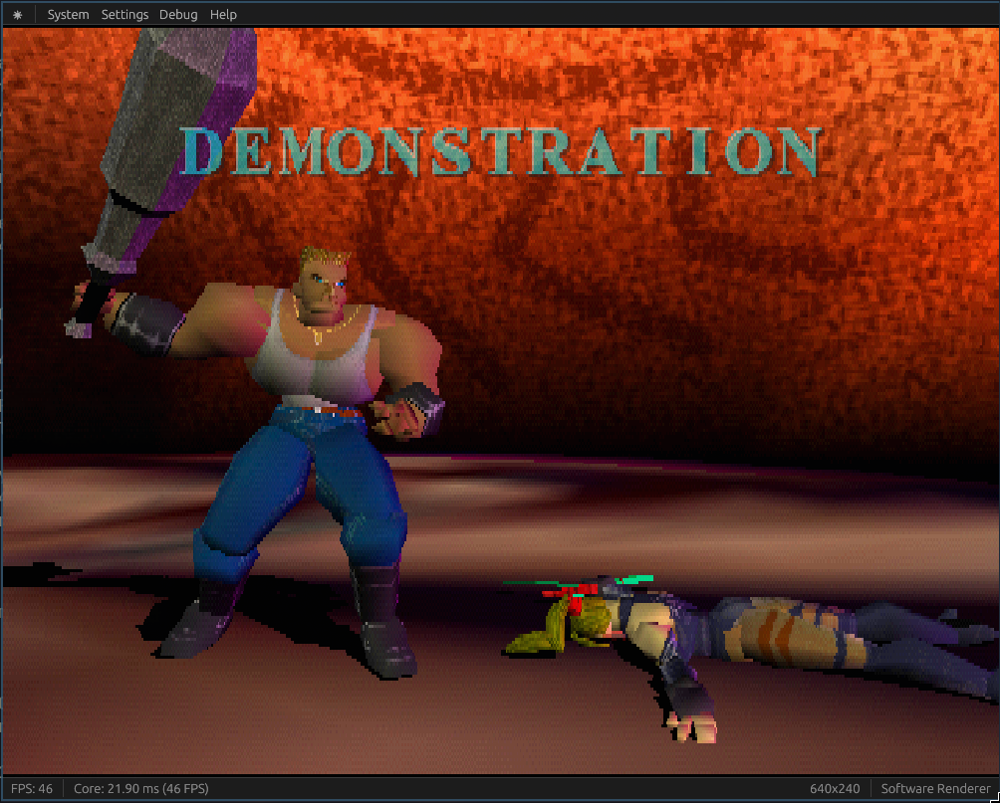
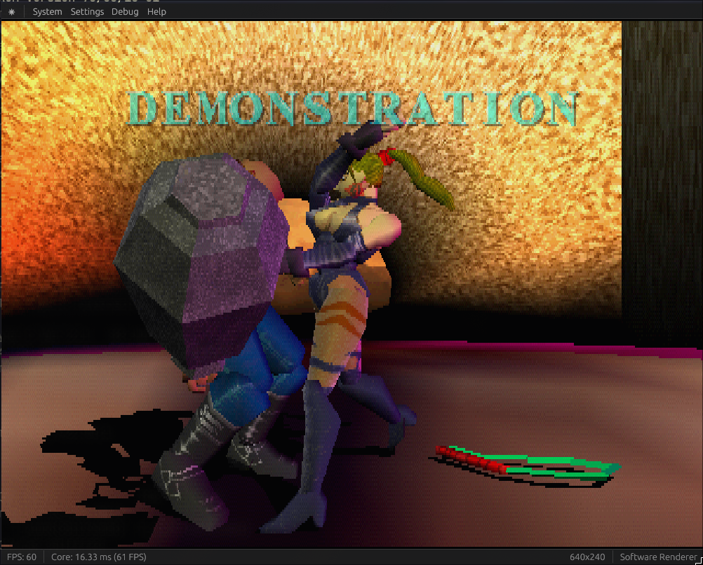

## Introduction

I've been writing a PlayStation emulator in Rust for a while now called [StarPSX](https://github.com/kaezrr/starpsx) and I've been doing some runtime optimizations by changing how I compile my code.

The results speak for themselves, take a look (see the Core FPS counter at the bottom left):

#### *Before ~ **46 FPS***

#### *After ~ **61 FPS***


That's a **57% increase** in performance, without touching a single line of code! Let's see how we did it.

**Note:** These are by no means an accurate nor comprehensive benchmark. I'm just using a heavy scene that my emulator struggles on.

All the changes are cumulative, starting from a baseline of **29fps** in default release mode.

---

## Reducing Code Generation Units

```toml
codegen-units = 1
```

**Result:** `29fps` → `33fps` **(+13.8%)**

By default, Rust splits your crate into multiple units to compile in parallel. Setting this to 1 forces all code to be compiled as a single unit, which gives the compiler more context for optimizations. The tradeoff is slower compile times, but better runtime performance since the optimizer can see more of your code at once.

---

## Enabling Link-Time Optimization

```toml
lto = "fat"
```

**Result:** `33fps` → `37fps` **(+12.1%)**

Link-Time Optimization (<abbr title="Link-Time Optimization">LTO</abbr>) performs optimizations across the entire program during linking, rather than just within individual compilation units. "Fat" LTO is the most aggressive option: it optimizes across all crates in your dependency tree. This catches optimization opportunities that were previously invisible when each crate was compiled separately.

---

## Using Native CPU Instructions

```toml
rustflags = ["-C", "target-cpu=native"]
```

**Result:** `37fps` → `52fps` **(+40.5%)**

This tells the compiler to generate code that uses all the instruction sets available on your specific CPU. Instead of targeting a generic x86-64 baseline, it can use modern <abbr title="Single Instruction, Multiple Data">SIMD</abbr> instructions and other CPU-specific features. The downside is the binary won't be portable to older CPUs, but for a personal project this is usually worth it.

---

## Binary Size Optimizations

Binary size is **10MB** right now, so let's try to optimize it:

### Switching to Abort on Panic

```toml
panic = "abort"
```

**Result:** `52fps`, `10MB` → `9.16MB` **(-8.4%)**

By default, Rust includes unwinding machinery to properly clean up when a panic occurs. Switching to abort means panics immediately terminate the program without cleanup. This removes all the unwinding code from your binary, saving space. Performance stays the same since we're not panicking in our hot loops anyway.

### Stripping Debug Symbols

```toml
strip = "symbols"
```

**Result:** `52fps`, `9.16MB` → `8.34MB` **(-9.0%)**

Debug symbols help with debugging but aren't needed in release builds. Stripping them removes metadata like function names and line numbers from the binary, shrinking it without affecting runtime performance at all.

---

## Compile Time Experiments

Let's see what the `cargo clean{:sh}` compile time is with all this stuff:

```console
Finished `release` profile [optimized] target(s) in 1m 16s
```

Not good, not terrible. Let's see if we can improve it.

### Testing the Wild Linker

I've heard good things about the "wild" linker, so let's see how it does:

```console
Finished `release` profile [optimized] target(s) in 1m 14s
```

**Result:** `76s` → `74s` **(-2.6%)**

Hmm, well that didn't do much. Within margin of error, I would say. Wild is a newer linker that aims to be faster than the default, but with `codegen-units = 1{:toml}` and `lto = "fat"{:toml}`, linking isn't the bottleneck: codegen is.

### Trying Parallel Front-End Compilation

```toml
threads = 8
```

**Result:**
```console
Finished `release` profile [optimized] target(s) in 1m 15s
```

**Result:** `74s` → `75s` **(+1.4%)**

RIP. I think `codegen-units = 1{:toml}` might be nullifying the parallelism... The parallel front-end speeds up the parsing and type-checking phases, but since we're forcing single-unit codegen for runtime performance, we're blocking the main parallelization opportunity. I could try other experimental features like using the cranelift codegen backend instead of LLVM but that would affect runtime performance.

---

## Conclusion

I also want to explore *Profile Guided Optimization (PGO)* too sometime in the future, but overall I think these are all good results: around a **79% increase** in runtime performance (**29fps** to **52fps**) without changing a single line of code.
